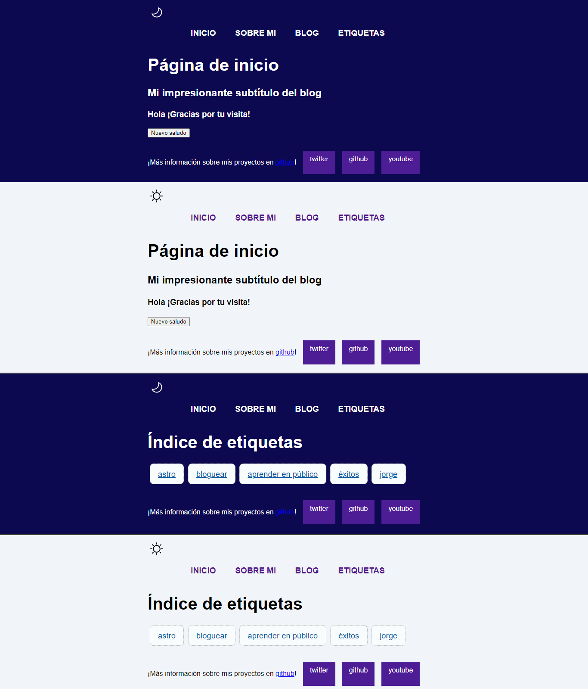

<hr>
<div>
<p style = 'text-align:center'>

</p>
</div>

<h2 align="center" style="color:#CD5C5C">JLG'777' </h2>

<p align="center">
<a href="https://git.io/typing-svg"></a>
</p>
<hr>

## 📧 Connect with me:

[](mailto:proyectojlg777@gmail.com)
[](https://www.linkedin.com/in/dev-jlg-18ba1a2b8?utm_source=share&utm_campaign=share_via&utm_content=profile&utm_medium=android_app)
[](jorgeg777#9720)

# 🎫 Blog con Astro

_Este proyecto es una página de blogs construida utilizando Astro, un moderno framework de construcción de sitios web. Astro permite crear sitios web rápidos y optimizados aprovechando los últimos estándares web y técnicas de desarrollo. Esta página de inicio está diseñada para ser atractiva y funcional, proporcionando una experiencia de usuario fluida y eficiente._



## 🪢 Características

Lista de las principales características del proyecto. Esto puede incluir:

- Rendimiento Optimo: Utiliza la tecnología de Astro para cargar solo el contenido necesario, lo que resulta en tiempos de carga rápidos.
- Diseño Responsivo: Se adapta a diferentes tamaños de pantalla y dispositivos para ofrecer una experiencia consistente en móviles y escritorios.
- Fácil de Usar: Interfaz intuitiva para crear y gestionar publicaciones de blog.
- Optimización SEO: Incluye características para mejorar la visibilidad en motores de búsqueda.
- Comentarios y Compartición: Integración con servicios de comentarios y opciones para compartir en redes sociales.

## 🚀 Comenzando

_Estas instrucciones te permitirán obtener una copia del proyecto en funcionamiento en tu máquina local para propósitos de desarrollo y pruebas._

### 🔧 Instalación

_Una serie de ejemplos paso a paso que te dice lo que debes ejecutar para tener un entorno de desarrollo ejecutandose._

[](https://stackblitz.com/github/withastro/astro/tree/latest/examples/minimal)
[](https://codesandbox.io/p/sandbox/github/withastro/astro/tree/latest/examples/minimal)
[](https://codespaces.new/withastro/astro?devcontainer_path=.devcontainer/minimal/devcontainer.json)

#### 🧍‍♂️🧍‍♂️ Clonar el repositorio

```
git clone https://github.com/jlg777/astro-web.git
```

#### 🚢 Navegar al directorio del proyecto

```
cd nombre-del-proyecto
```

#### 🚨 Instalar dependencias

```
npm install
```

## 🚀 Estructura del proyecto

Dentro de tu proyecto de Astro, verás las siguientes carpetas y archivos:

```text
/
├── public/
├── src/
│   └── pages/
│       └── index.astro
└── package.json
```

Astro busca archivos `.astro` o `.md` en el directorio `src/pages/`. Cada página se expone como una ruta basada en el nombre del archivo.

En `src/components/`, puedes colocar cualquier componente de Astro/React/Vue/Svelte/Preact.

Cualquier recurso estático, como imágenes, puede colocarse en el directorio `public/`.

## 🧞 Comandos

    Todos los comandos se ejecutan desde la raíz del proyecto, desde una terminal:

| Command                   | Action                                           |
| :------------------------ | :----------------------------------------------- |
| `bun install`             | Installs dependencies                            |
| `bun run dev`             | Starts local dev server at `localhost:4321`      |
| `bun run build`           | Build your production site to `./dist/`          |
| `bun run preview`         | Preview your build locally, before deploying     |
| `bun run astro ...`       | Run CLI commands like `astro add`, `astro check` |
| `bun run astro -- --help` | Get help using the Astro CLI                     |

## 🛠️ Construido con

- [Astro](http://www.https://docs.astro.build/es/getting-started/) - El framework web usado
- [Bun](https://bun.sh/docs/bundler) - Manejador de dependencias

## ✒️ Autores

_Menciona a todos aquellos que ayudaron a levantar el proyecto desde sus inicios_

- **Jorge Grandía** - _Trabajo Inicial_ - [JLG777](https://github.com/jlg777)
- **Jorge Grandía** - _Documentación_ - [JLG777](#jlg777)

También puedes mirar la lista de todos los [contribuyentes](https://github.com/your/project/contributors) quíenes han participado en este proyecto.

## 🖇️ Contribuyendo

Las contribuciones son lo que hacen a la comunidad de código abierto un lugar increíble para aprender, inspirar y crear. Cualquier contribución que hagas es muy apreciada. Por favor, lee el [CONTRIBUTING.md](https://gist.github.com/brayandiazc/xxxxxx) para detalles sobre nuestro código de conducta, y el proceso para enviarnos pull requests.

## 📄 Licencia

Este proyecto está bajo la Licencia MIT - mira el archivo [LICENSE.md](LICENSE.md) para detalles

## 🎁 Expresiones de Gratitud

- Comenta a otros sobre este proyecto 📢
- Invita una cerveza 🍺 o un café ☕ a alguien del equipo.
- Da las gracias públicamente 🤓.
- Dona con cripto a esta dirección:
  - (btc) `16ApGFxMXfF8ktysSkmLBzLEJPHubtwKjp`
  - (btc-SegWit) `bc1q0v8fvv3gvga02h9xspcg7npghjfyny20lavc37`
  - (Ethereum) `0x1ee2842c194c95bc54473c6b27d602fc0bfc81a9`

---

⌨️ con ❤️ por [JLG777](https://github.com/jlg777) 😊

_Copyright (c) [2024] [jlg777]_
